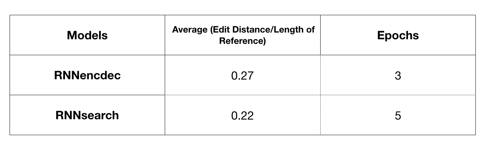

## About

This is the final project of Deep Learning (CS2470, Fall 2017) at Brown University replicating the paper proposed by [Bahdanau *et al*. (2014)][1]. We implemented RNNencdec and RNNsearch and compared their performance in machine translation mesured by edit distance.

## Data

Hansard

## Results

## Group Members

@shihan9
@baichuan55555

[1]: https://arxiv.org/abs/1409.0473
